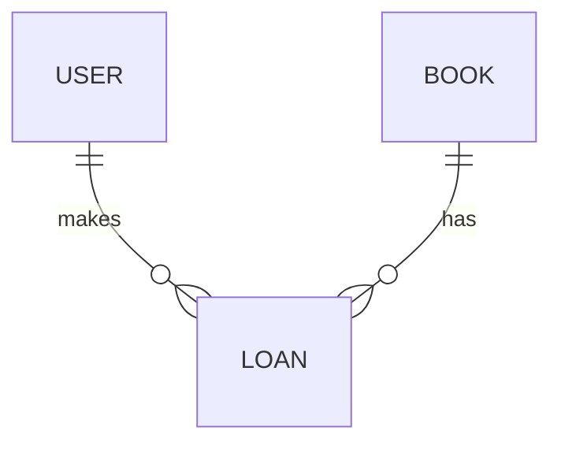

# GABARITO AULA 01: INTRODUÇÃO À MODELAGEM

## RESPOSTA 1: OLTP vs OLAP

**a) Cenário A é OLTP.**
Requer ALTA performance de escrita/leitura para uma única transação (atômica, consistente).
Dados normalizados para evitar erro de duplicidade (não cobrar 2x).

**Cenário B é OLAP.**
Requer leitura de GRANDES volumes de dados históricos.
Dados desnormalizados (Star Schema) facilitam joins e queries de agregação (SUM, AVG).

**b)**
- **Normalizada (OLTP):** Sistema de Pagamento.
- **Desnormalizada (OLAP):** Dashboard.

## RESPOSTA 2: Tipos de Modelagem (Biblioteca)

**a) Conceitual:**
[Usuário] --- <Empresta> --- [Livro]


(Relação Muitos-para-Muitos: 1 usuário pode ler N livros, 1 livro pode ser lido por N usuários).

**b) Físico:**
Tabela Associativa: `emprestimo` (`usuario_id`, `livro_id`, `data_emprestimo`).
CHAVE PRIMÁRIA COMPOSTA (PK): (`usuario_id`, `livro_id`, `data_emprestimo`) -> permite emprestar o mesmo livro em datas diferentes.

## RESPOSTA 3: DDL Básico

**ERD (Físico):**



**a) SQL:**
*(Note como separamos as entidades em tabelas diferentes para evitar redundância - o início da Normalização)*

```sql
CREATE TABLE IF NOT EXISTS usuario (
    usuario_id SERIAL PRIMARY KEY,
    nome VARCHAR(100) NOT NULL,
    email VARCHAR(100) UNIQUE
);

CREATE TABLE IF NOT EXISTS livro (
    livro_id SERIAL PRIMARY KEY,
    titulo VARCHAR(200) NOT NULL,
    isbn VARCHAR(13) UNIQUE
);

CREATE TABLE IF NOT EXISTS emprestimo (
    usuario_id INTEGER REFERENCES usuario (usuario_id),
    livro_id INTEGER REFERENCES livro (livro_id),
    data_emprestimo DATE DEFAULT CURRENT_DATE,
    PRIMARY KEY (usuario_id, livro_id, data_emprestimo)
);
```

### ASSERTIONS (VALIDAÇÃO DE RESULTADOS)

```sql
DO $$
BEGIN
   -- Verificando existência das tabelas criadas no exercício 3
   IF NOT EXISTS (SELECT 1 FROM information_schema.tables WHERE table_name = 'emprestimo') THEN
      RAISE EXCEPTION 'Erro: Tabela emprestimo não foi criada';
   END IF;
   
   RAISE NOTICE 'VALIDAÇÃO AULA 01: SUCESSO! ✅';
END $$;
```
