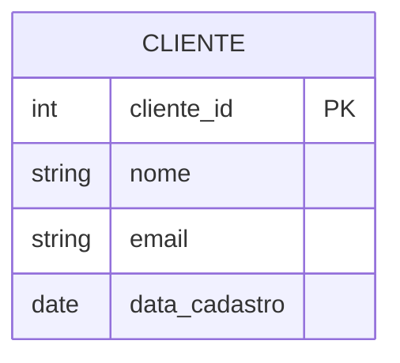
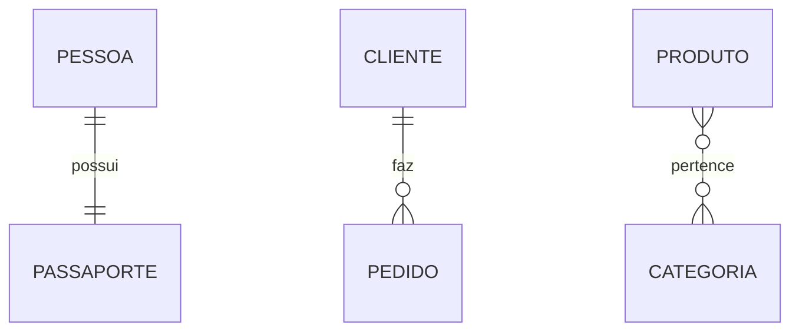
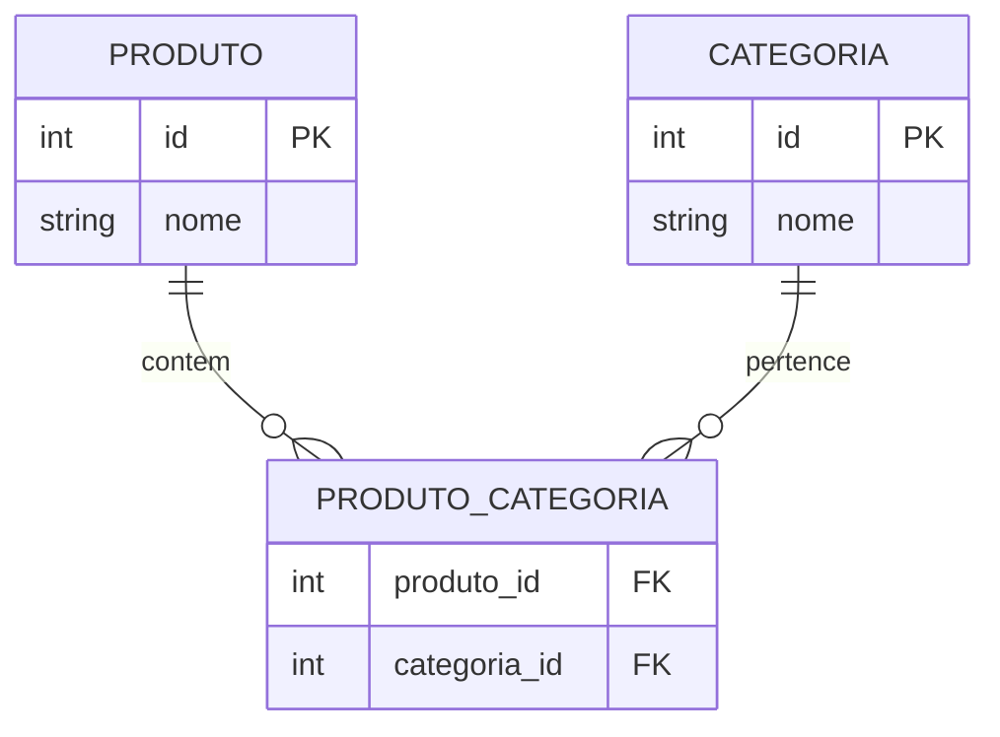

# Aula 2: Entity Relationship Diagrams (ERD) - Parte 1

## 🎯 Objetivos
- Entender os componentes fundamentais de um ERD.
- Compreender relacionamentos e cardinalidade.
- Aplicar as **Formas Normais (1NF, 2NF, 3NF)** para evitar redundância.
- Saber ler e interpretar diagramas de banco de dados.

---

## 🛠️ O que é um ERD?
Um **Diagrama Entidade-Relacionamento (ERD)** é uma representação visual das tabelas de um banco de dados e como elas se conectam.

- **Para que serve?** Comunicação entre times, documentação técnica e serve como o *blueprint* para a implementação física.
- **Ferramentas sugeridas:** dbdiagram.io, draw.io, Lucidchart.

---

## 📦 Entidades e Atributos
- **Entidade:** Uma "coisa" ou objeto do mundo real sobre o qual queremos guardar informações (ex: Cliente, Produto, Pedido).
- **Atributos:** As propriedades ou características dessa entidade (ex: Nome do Cliente, Preço do Produto).

### Exemplo em SQL:
```sql
CREATE TABLE cliente (
    cliente_id SERIAL PRIMARY KEY,
    nome VARCHAR(100) NOT NULL,
    email VARCHAR(100) UNIQUE,
    data_cadastro DATE DEFAULT CURRENT_DATE
);
```

### Representação Visual (ERD):


---

## 🔑 Chaves (Keys)
1. **Chave Primária (PK):** O identificador único de cada linha em uma tabela. Não pode haver duplicatas.
2. **Chave Estrangeira (FK):** Um campo que cria um link entre duas tabelas, referenciando a PK de outra tabela.
3. **Natural vs Surrogate:**
    - *Natural:* Um dado real (ex: CPF).
    - *Surrogate:* Um ID gerado pelo sistema (ex: SERIAL ID).

---

## 🔗 Relacionamentos e Cardinalidade
Define como as instâncias de uma entidade se relacionam com as instâncias de outra.

- **1:1 (Um para Um):** Uma Pessoa tem exatamente um Passaporte.
- **1:N (Um para Muitos):** Um Cliente faz muitos Pedidos (O mais comum).
- **N:N (Muitos para Muitos):** Muitos Produtos pertencem a muitas Categorias.



### Implementando N:N (Tabela Associativa):
```sql
CREATE TABLE produto_categoria (
    produto_id INTEGER REFERENCES produto(produto_id),
    categoria_id INTEGER REFERENCES categoria(categoria_id),
    PRIMARY KEY (produto_id, categoria_id)
);
```



---

## 🧩 Formas Normais (Normalização na Prática)

Para garantir que o nosso ERD seja eficiente, seguimos as **Formas Normais**. Elas são um "checklist" para evitar redundância.

1.  **1ª Forma Normal (1NF) - Atomicidade:**
    - Cada coluna deve conter apenas um valor (valores atômicos).
    - Não pode haver grupos repetidos (ex: "Telefone1", "Telefone2").
    - *Ação:* Se um usuário tem 3 telefones, crie uma tabela de Telefone ligada ao Usuário.

2.  **2ª Forma Normal (2NF) - Dependência Total:**
    - Deve estar na 1NF.
    - Todos os atributos que não são chave devem depender da **chave primária completa** (importante em chaves compostas).
    - *Ação:* Se você tem uma tabela `Venda_Itens` e o "Nome do Fornecedor" está lá, ele depende do Fornecedor, não da Venda. Mova para a tabela de Fornecedor.

3.  **3ª Forma Normal (3NF) - Dependência Transitiva:**
    - Deve estar na 2NF.
    - Atributos não-chave não devem depender de outros atributos não-chave.
    - *Ação:* Se na tabela `Cliente` você tem "Cidade" e "CEP", e o CEP determina a Cidade, a Cidade não deve estar lá diretamente.

> **Resumo Didático:** O dado deve depender da Chave (1NF), de toda a Chave (2NF) e de nada além da Chave (3NF).

---

## 🏁 Fechamento
- ERDs são fundamentais para visualizar a estrutura do dado.
- Relacionamentos definem a lógica do seu negócio no banco.
- **Preview:** Na próxima aula, vamos modelar um sistema de Biblioteca completo!
