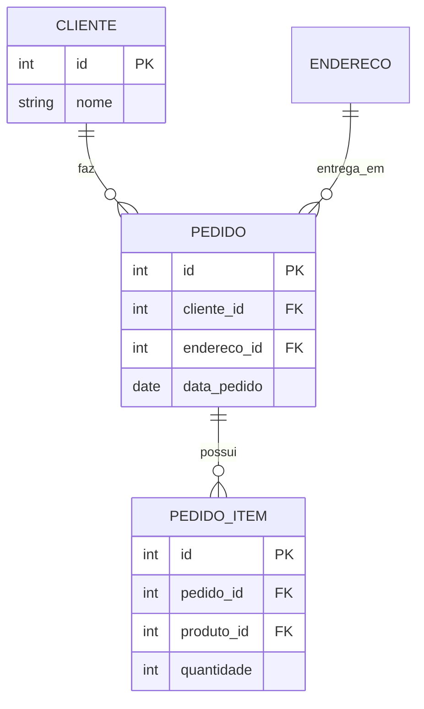
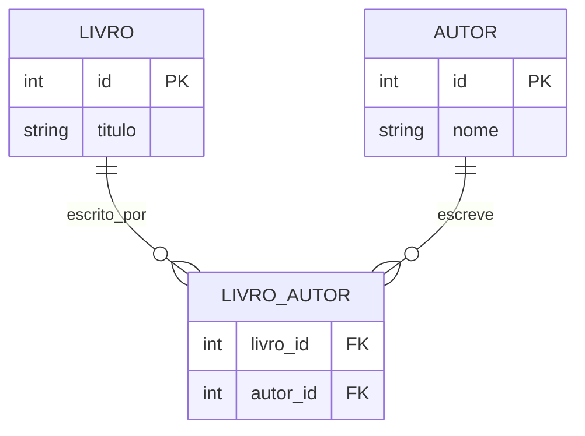
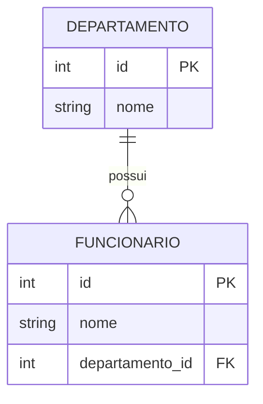

# GABARITO AULA 02: ERD FUNDAMENTOS & TIPOS DE DADOS

## RESPOSTA 1: Entidades (Normalização)

**a) `Itens_Do_Pedido`:**
É uma lista de valores. Viola a **1NF (Atomicidade)**. Deve ser separado em uma tabela própria (`Pedido_Itens`), onde cada linha representa um único item.

**b) `Cidade_Entrega`:**
Manter o nome da cidade no pedido gera redundância e viola a **2NF/3NF**. Se o CEP muda ou se queremos analisar vendas por região, ter a cidade escrita manualmente em cada pedido causa inconsistências (Anomalia de Atualização).
- **Ideal:** O endereço (com CEP e Cidade) deve ser uma entidade separada ou estar ligada ao Cliente. O pedido referencia o ID desse endereço.

**Repetição de Dados:** Ocupa espaço e gera inconsistência. Se 'São Paulo' for escrito 'S. Paulo' em um pedido e 'SP' em outro, a agregação de dados falha. Centralizar em uma tabela garante a "Única Fonte da Verdade".



## RESPOSTA 2: Relacionamentos

**a) N:N (Muitos-para-Muitos).**
Exige Tabela Associativa (Intermediária): `Livro_Autor` (livro_id, autor_id).



**b) 1:N (Um-para-Muitos).**
Chave Estrangeira (FK) na tabela `Funcionario` apontando para `Departamento_ID`.
(Um Funcionário "tem um" Departamento).



## RESPOSTA 3: Cardinalidade

**a)**
- **PK:** `id` (identificador único do empréstimo).
- **FK:** `usuario_id` (aponta p/ Usuario), `livro_id` (aponta p/ Livro).

A PK `id` garante unicidade do evento de empréstimo, não do usuário.

### ASSERTIONS (VALIDAÇÃO DE RESULTADOS)

```sql
DO $$ BEGIN RAISE NOTICE 'VALIDAÇÃO AULA 02: SUCESSO! ✅'; END $$;
```
