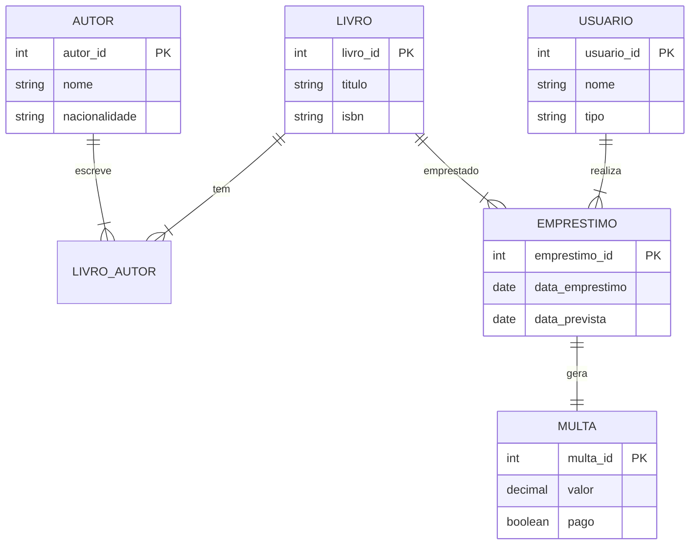

# Aula 3: ERD Parte 2 - Prática (Sistema de Biblioteca)

## 🎯 Objetivos
- Aplicar conceitos de ERD em um caso de uso real.
- Modelar um sistema de biblioteca do zero.
- Implementar o modelo físico no PostgreSQL.

---

## 📖 O Caso: Biblioteca Universitária
Precisamos de um sistema que gerencie:
1.  **Livros e Autores:** Com suporte a livros com múltiplos autores.
2.  **Usuários:** Cadastro de Alunos e Professores.
3.  **Empréstimos:** Controle de quem pegou qual livro e quando deve devolver.
4.  **Multas:** Registro de penalidades para devoluções atrasadas.

---

## 🧩 Identificando Entidades
1.  **Livro:** Título, ISBN, Ano.
2.  **Autor:** Nome, Nacionalidade.
3.  **Usuario:** Nome, Tipo (Aluno/Prof), Email.
4.  **Emprestimo:** Data Empréstimo, Data Prevista, Data Real.
5.  **Multa:** Valor, Status de pagamento.

---

## 🔗 Definindo Relacionamentos
- **Livro <-> Autor (N:N):** Um livro pode ter vários autores, e um autor pode escrever vários livros. Precisamos da tabela `livro_autor`.
- **Usuario -> Emprestimo (1:N):** Um usuário pode fazer vários empréstimos.
- **Livro -> Emprestimo (1:N):** Um livro físico pode ser emprestado várias vezes ao longo do tempo.
- **Emprestimo -> Multa (1:1):** Um empréstimo específico gera no máximo uma multa se atrasado.

---

## 🎨 Diagrama ERD (Biblioteca)
Visualizando as entidades e seus relacionamentos:



---

## 💻 Implementação (Snippet)
```sql
CREATE TABLE livro_autor (
    livro_id INTEGER REFERENCES livro(livro_id),
    autor_id INTEGER REFERENCES autor(autor_id),
    PRIMARY KEY (livro_id, autor_id)
);

CREATE TABLE emprestimo (
    emprestimo_id SERIAL PRIMARY KEY,
    usuario_id INTEGER REFERENCES usuario(usuario_id),
    data_emprestimo DATE DEFAULT CURRENT_DATE,
    data_devolucao_prevista DATE NOT NULL
);
```

---

## 🏁 Fechamento
- Modelagem prática exige entender as regras de negócio.
- Constraints como `REFERENCES` e `CHECK` garantem que o dado não se corrompa.
- **Preview:** Na próxima aula, saímos do mundo operacional e entramos na Modelagem Dimensional!
