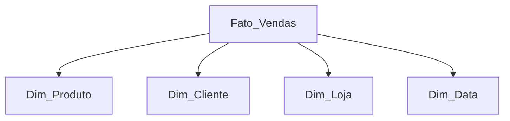
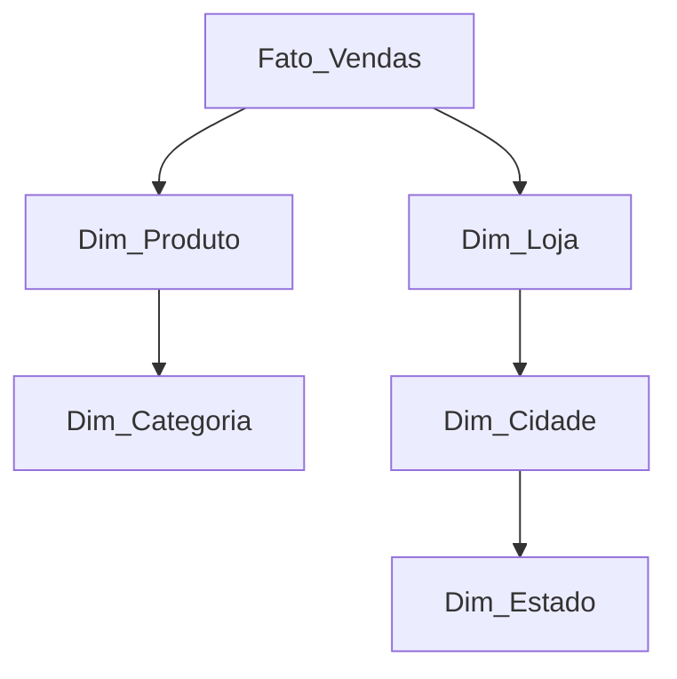

# Aula 4: Modelagem Dimensional - Conceitos

## 🎯 Objetivos
- Entender a transição de OLTP (Operacional) para OLAP (Analítico).
- Conhecer os esquemas **Star Schema** e **Snowflake**.
- Compreender os conceitos fundamentais de **Fatos** e **Dimensões**.

---

## 🔄 Transição: OLTP → OLAP
Modelos operacionais são ótimos para inserir dados, mas péssimos para relatórios complexos. Precisamos de uma estrutura otimizada para **leitura**.

- **Problema:** Muitos JOINs em tabelas normalizadas tornam as queries lentas.
- **Solução:** Modelagem dimensional (foco no que o negócio quer medir).

---

## ⭐ Star Schema (Esquema Estrela)
É o padrão mais comum em Data Warehousing. 

- **Estrutura:** Uma tabela de fatos central conectada diretamente a várias tabelas de dimensão.
- **Vantagens:** 
    - Simplicidade extrema.
    - Alta performance (poucos JOINs).
    - Fácil de entender para usuários de negócio.

---

## 🎨 Visualizando: Star Schema
O fato (Vendas) está no centro, conectado diretamente às dimensões.

---

## ❄️ Snowflake Schema (Esquema Floco de Neve)
Uma variação do Star Schema onde as dimensões são normalizadas.

- **Diferença:** As dimensões têm suas próprias sub-dimensões.
- **Quando usar:** Dimensões extremamente grandes onde a economia de espaço compensa a perda de performance.
- **Trade-off:** Mais JOINs e maior complexity de query.

### 🎨 Visualizando: Snowflake Schema
Note como as dimensões "se ramificam" em outras tabelas normalizadas.

---

## 📊 Fatos vs Dimensões
### Fatos (O que aconteceu?)
Representam processos de negócio (Vendas, Cliques, Transações).
- **Métricas:** Valores numéricos, aditivos (valor, quantidade).
- **Volume:** Tabelas gigantes (milhões/bilhões de linhas).

### Dimensões (Onde? Quem? Quando?)
Representam o contexto do evento.
- **Atributos:** Textos descritivos (Nome do Cliente, Categoria do Produto).
- **Volume:** Tabelas menores (centenas/milhares de linhas).

---

## 🏁 Fechamento
- Star Schema prioriza a performance do analista.
- Fatos guardam os números; Dimensões guardam os filtros.
- **Preview:** Na próxima aula, vamos mergulhar fundo nas Tabelas Fato!
