# Aula 8: Fato e Dimensão na Prática (Caso Varejo)

## 🎯 Objetivos
Nesta aula prática, o foco é integralmente no código e na execução dentro do banco de dados. Vamos construir um pipeline dimensional idempotente e analisar o impacto do histórico nos dados, materializado no arquivo **`apresentacao.sql`**.

---

## 🛠️ Pré-requisitos
Antes de inspecionar e executar o script principal, certifique-se de que o ambiente OLTP de origem está criado rodando o setup:
```sql
\i scripts/setup_varejo.sql
```

---

## 🔀 Grafo de Execução (DAG do Pipeline — Medallion Architecture)

O diagrama abaixo mostra o fluxo completo de dependências do pipeline, organizado nas três camadas da **Medallion Architecture** (Bronze → Silver → Gold). Os **nós** representam os artefatos de dados (tabelas e views) e as **arestas** indicam a procedure ou view que conecta cada transformação.

```mermaid
graph LR
    subgraph BRONZE["🥉 Bronze Layer"]
        B_anchor(( ))
        OC["origem_cliente"]
        OP["origem_produto"]
        OV["origem_venda"]
    end

    subgraph SILVER["🥈 Silver Layer"]
        S_anchor(( ))
        CSD["cliente_snapshot_diario"]
        DC1["dim_cliente_scd1"]
        DC2["dim_cliente_scd2"]
        DP3["dim_produto_scd3"]
        FV["fato_vendas"]
        VAM["vendas_array_mensal"]
        CAA["cliente_atividade_acum"]
        metrics_fanin(("metrics fan-in"))
    end

    subgraph GOLD["🥇 Gold Layer"]
        direction TB
        G_anchor(( ))
        gold_entry(("gold entry"))
        RSCD["mart_reconstrucao_scd2"]
        GMD["gold_metricas_diarias"]
        gold_entry -->|"Gap-And-Island · on-demand"| RSCD
        gold_entry -->|"daily metrics · incremental"| GMD

    end

    subgraph MARTS["📊 Semantic Layer"]
        M_anchor(( ))
        semantic_fanout(("semantic fan-out"))
        MA["mart_metricas_acum"]
        JC["mart_jcurve"]
        JCF["mart_jcurve_fmt"]
        RD7["mart_retencao_d7"]
    end

    B_anchor ~~~ S_anchor ~~~ G_anchor ~~~ M_anchor

    OC --> CSD
    OC --> DC1
    OC --> DC2
    OP --> DP3
    OV --> FV

    FV -->|"atividade derivada"| CAA
    CSD -->|"VIEW Gap-And-Island"| RSCD

    DC2 -->|Point-In-Time| FV
    DC2 --> VAM
    FV --> VAM

    FV --> metrics_fanin
    CAA --> metrics_fanin
    DC2 --> metrics_fanin
    metrics_fanin --> gold_entry

    GMD --> semantic_fanout
    CAA --> semantic_fanout
    semantic_fanout -->|"acumulado · incremental"| MA
    semantic_fanout -->|"j-curve · on-demand"| JC
    semantic_fanout -->|"retencao d7 · on-demand"| RD7
    JC -->|"formatted · on-demand"| JCF

    classDef bronze fill:#cd7f32,stroke:#a0622a,color:#fff
    classDef silver fill:#a8a9ad,stroke:#7a7b7f,color:#fff
    classDef gold fill:#d4af37,stroke:#b8960e,color:#fff
    classDef mart fill:#3c7be0,stroke:#2f5fb3,color:#fff
    classDef router fill:#444,stroke:#222,color:#fff
    classDef invis fill:none,stroke:none,color:transparent,stroke-width:0px

    class OC,OP,OV bronze
    class CSD,DC1,DC2,DP3,FV,CAA,VAM silver
    class GMD,RSCD gold
    class MA,JC,JCF,RD7 mart
    class metrics_fanin,gold_entry,semantic_fanout router
    class B_anchor,S_anchor,G_anchor,M_anchor,GP1,GP2 invis
```



### Legenda do Grafo

| Camada | Nós (Tabelas/Views) | Arestas (Procedures) |
|--------|---------------------|----------------------|
| 🥉 **Bronze** | `origem_cliente`, `origem_produto`, `origem_venda` — tabelas OLTP brutas | — |
| 🥈 **Silver** | `cliente_snapshot_diario`, `dim_cliente_scd1/2`, `dim_produto_scd3`, `fato_vendas`, `cliente_atividade_acumulada`, `vendas_array_mensal` | `proc_snapshot_clientes`, `proc_upsert_*`, `proc_ingestao_fato_vendas`, `proc_acumular_*` |
| 🥇 **Gold** | `gold_metricas_diarias`, `mart_reconstrucao_scd2` | `proc_ingestao_gold_diaria` |
| 📊 **Semantic** | `mart_*` views analíticas (`jcurve`, `retencao`, etc) | Consultas `on-demand` sob as tabelas Gold/Silver |

### 🗓️ A Fronteira entre DBT e Airflow

Neste laboratório usamos o ecossistema local e puro do PostgreSQL (`Procedures` e `Loops`). Porém, em um Data Warehouse moderno onde este pattern roda em produção, a arquitetura é estritamente dividida:

- **dbt Responsibility (O Transformador):** Toda a modelagem dimensional, os `CREATE VIEW` analíticos, os UPSERTS idempotentes (`ON CONFLICT`), o processamento de Strings Array e o Bitwise (`>>`). Ele simplesmente transforma os dados baseado numa data que lhe foi entregue (templating puro). Cada nó do Diagrama acima seria um arquivo `.sql` no seu repositório do dbt no padrão de materializações.
- **Airflow Responsibility (O Orquestrador):** É responsável pela **Ordem de Execução**, e por controlar e injetar a **linha do tempo**. As *Procedures Orquestradoras* (DAGs) e o *Fast-Forward* (Backfills) do nosso script simulam exatamente o Apache Airflow mandando rodar tarefas de forma assíncrona com base na data do agendamento (o famoso `{{ ds }}`), garantindo que no caso de falhas, a idempotência do banco mantenha o estado exato.

### Ordem de Execução (O papel do Airflow via `proc_executar_pipeline_diario`)
```text
A DAG principal engloba os seguintes passos no motor do dbt para o dia (dt):

Bronze → Silver:
  1. proc_snapshot_clientes(dt)           → cliente_snapshot_diario (foto do OLTP)
  2. proc_upsert_clientes_scd2(dt)       → dim_cliente_type2
  3. proc_upsert_produtos_scd3(dt)       → dim_produto_type3
  4. proc_ingestao_fato_vendas(dt)        → fato_vendas (depende de dim_cliente_type2)
  5. proc_acumular_atividade(dt-1, dt)    → cliente_atividade_acumulada
  6. proc_acumular_vendas_mensal(dt)      → cliente_vendas_array_mensal

Silver → Gold:
  7. proc_ingestao_gold_diaria(dt)        → gold_metricas_diarias (depende de fato + cumulative + dim)

Gold / Silver → Semantic (On-Demand):
  - As visões (`mart_*` como j-curve, retenção, e reconstrução gap-and-island) não requerem "ingestão diária". Elas refletem de imediato as atualizações materializadas no DW sempre que forem consultadas.
```

---

## 📜 Estrutura do `apresentacao.sql`

O script está mapeado passo a passo para simular o fluxo de Data Engineering:

### 1. Modelagem Dimensional (SCD Types 1, 2 e 3)
- **Type 1 (Sem Histórico):** Atualização in-place da Dimensão Cliente.
- **Type 2 (Histórico Completo):** O "Padrão Ouro". Implementa a gestão de SKs (`cliente_sk`), datas de validade (`data_inicio`, `data_fim`) e uso de `JSONB` para auditar instantaneamente quais colunas sofreram mutação (`properties_diff`).
- **Type 3 (Histórico Limitado):** Registro de `categoria_atual` e `categoria_anterior` na dimensão Produto.

### 2. Gap-And-Island (Reconstrução SCD2 via Snapshots Incrementais)
- Tabela `cliente_snapshot_diario` captura a "foto" diária do OLTP incrementalmente via `proc_snapshot_clientes`. A view `mart_reconstrucao_scd2` reconstrói o SCD2 do zero usando apenas esses snapshots brutos — sem dependência da `dim_cliente_type2` — provando o padrão Gap-And-Island na prática.

### 3. Tabela Fato e a Resolução Point-In-Time
- Processo de ingestão que limpa a janela do dia atual (`DELETE`) para garantir idempotência, e amarra as vendas à SK exata do cliente no instante da compra.

### 4. Fato Acumulada e Padrão "Yesterday + Today"
- Evita JOINS caros agrupando a atividade diária de cada cliente. Transforma eventos brutos em listas de acessos ao longo do tempo.

### 5. Modelagem Comportamental Avançada (Datint / Bitwise)
- **Array Posicional O(1):** Mantemos um array por mês indexado pelo dia, permitindo agregar o faturamento mensal sem ler 30 linhas diárias na tabela Fato. Também já pré-agregamos o `valor_acumulado_mes` a cada incremento diário.
- **Bitwise / Datint:** Uso pesado de Álgebra Booleana para comprimir a assiduidade diária e mensal num inteiro de 32-bits (Bitmask), habilitando cálculos instantâneos de retenção contínua e as métricas para as safras da "J-Curve".

### 6. Relatório de Desempenho (Profiling)
- O pipeline orquestrado implementa instrumentação (Telemetry) para apurar os tempos exatos do ambiente (via variável `varejo.dur_backfill` e blocos de profiling `clock_timestamp()`).
- O Fast-Forward de 60 dias roda de ponta a ponta com +2.000 clientes gerando vendas e recálculos incrementais de dezenas de tabelas de agregação na casa de **~40 segundos**. A consulta da J-Curve formatada para o Dataviz demora cerca de **~0.09s** — um avanço abismal perante Table Scans tradicionais.

---

## 🏃 Dinâmica da Prática
No próprio arquivo SQL, há uma seção de **Orquestração: Fast-Forward Incremental**.
- A primeira parte simula alterações de atributos dos indivíduos (mudança de estado civil, endereço ou categoria).
- Logo após, executamos o Pipeline de Ingestão via procedures num fluxo cronológico de dois meses.
- Por fim, o bloco de **Auditoria** possui as consultas analíticas montadas (visões As-Is vs As-Was, J-Curve, OBT) prontas para testar a sua base. Mergulhe no SQL!
