# Aula 8: Fato e Dimensão na Prática (Caso Varejo)

## 🎯 Objetivos
Nesta aula prática, o foco é integralmente no código e na execução dentro do banco de dados. Vamos construir um pipeline dimensional idempotente e analisar o impacto do histórico nos dados, materializado no arquivo **`apresentacao.sql`**.

---

## 🛠️ Pré-requisitos
Antes de inspecionar e executar o script principal, certifique-se de que o ambiente OLTP de origem está criado rodando o setup:
```sql
\i scripts/setup_varejo.sql
```

---

## 🔀 Grafo de Execução (DAG do Pipeline — Medallion Architecture)

O diagrama abaixo mostra o fluxo completo de dependências do pipeline, organizado nas três camadas da **Medallion Architecture** (Bronze → Silver → Gold). Os **nós** representam os artefatos de dados (tabelas e views) e as **arestas** indicam a procedure ou view que conecta cada transformação.

```mermaid
graph LR
    subgraph BRONZE["🥉 Bronze Layer · OLTP"]
        B_anchor(( ))
        OV[("origem_venda")]
        OC[("origem_cliente")]
        OP[("origem_produto")]
    end

    subgraph DAILY_PIPELINE["🚀 24h Execution Pipeline (Incremental)"]
        subgraph SILVER["🥈 Silver Layer"]
            S_anchor(( ))
            CSD["cliente_snapshot_diario"]
            DC1["dim_cliente_type1"]
            DC2["dim_cliente_type2"]
            DP3["dim_produto_type3"]
            RSCD["view_reconstrucao_scd2"]
            FV["fato_vendas"]
            CAA["fct_atividade_acum"]
            VAM["fct_vendas_mensal_array"]        
            metrics_fanin(("metrics fan-in"))
        end

        subgraph GOLD["🥇 Gold Layer"]
            direction TB
            G_anchor(( ))
            gold_entry(("gold entry"))
            GMD["fct_metricas_diarias"]
            gold_entry -->|"daily metrics · incremental"| GMD
        end

        subgraph SEMANTIC["📊 Semantic Layer"]
            M_anchor(( ))
            semantic_fanout(("semantic fan-out"))
            MA["mart_metricas_acumuladas"]
            JC["mart_jcurve_retencao"]
            RD["dataviz_retencao_bitwise"]
        end
    end

    subgraph DATAVIZ["📈 Data Visualization"]
        BI_TOOL[["Dashboard: PowerBI / Metabase / Tableau"]]
    end

    B_anchor ~~~ S_anchor ~~~ G_anchor ~~~ M_anchor

    OC --> DC1
    OC --> DC2
    OC --> CSD
    OP --> DP3
    OV --> FV

    DC2 -.->|"Point-In-Time join"| FV
    DC2 --> VAM
    CSD -->|"VIEW Gap-And-Island"| RSCD
    FV --> CAA
    CAA -->|"enriquecimento bitmap"| VAM
    VAM -->|"Revenue stream"| metrics_fanin
    DC2 -->|"Profile stats"| metrics_fanin
    metrics_fanin == "SILVER BUS" ==> gold_entry
    gold_entry == "D0 Payload" ==> GMD
    
    GMD == "Gold Metrics" ==> semantic_fanout
    CAA == "Activity Log" ==> semantic_fanout
    semantic_fanout -->|"Cumulatives (GMD)"| MA
    semantic_fanout -->|"Safra Coorte (CAA)"| JC
    semantic_fanout -->|"Retention Viz (CAA)"| RD

    MA --> BI_TOOL
    JC --> BI_TOOL
    RD --> BI_TOOL

    classDef bronze fill:#cd7f32,stroke:#a0622a,color:#000
    classDef silver fill:#a8a9ad,stroke:#7a7b7f,color:#000
    classDef gold fill:#d4af37,stroke:#b8960e,color:#000
    classDef mart fill:#3c7be0,stroke:#2f5fb3,color:#000
    classDef router fill:#444,stroke:#222,color:#fff
    classDef invis fill:none,stroke:none,color:transparent,stroke-width:0px
    classDef pipeline fill:none,stroke:#444,stroke-width:2px,stroke-dasharray: 5 5
    classDef bi fill:#fff,stroke:#333,stroke-width:3px

    class OC,OP,OV bronze
    class CSD,DC1,DC2,DP3,FV,RSCD,CAA,VAM,metrics_fanin silver
    class GMD,gold_entry gold
    class MA,JC,RD,semantic_fanout mart
    class B_anchor,S_anchor,G_anchor,M_anchor invis
    class DAILY_PIPELINE pipeline
    class BI_TOOL bi
```



### Legenda do Grafo

| Camada | Nós (Tabelas/Views) | Arestas (Procedures) |
|--------|---------------------|----------------------|
| 🥉 **Bronze** | `origem_cliente`, `origem_produto`, `origem_venda` — tabelas OLTP brutas | — |
| 🥈 **Silver** | `cliente_snapshot_diario`, `dim_cliente_type1/2`, `dim_produto_type3`, `fato_vendas`, `fct_atividade_acum`, `fct_vendas_mensal_array`, `view_reconstrucao_scd2` | `proc_snapshot_clientes`, `proc_upsert_*`, `proc_ingestao_fato_vendas`, `proc_acumular_*` |
| 🥇 **Gold** | `fct_metricas_diarias` | `proc_ingestao_gold_diaria` |
| 📊 **Semantic** | `mart_*` views analíticas (`jcurve`, `metricas_acumuladas`) | Consultas `on-demand` sob as tabelas Gold/Silver |

---

## 🗄️ Catálogo de Artefatos (Data Catalog)

Aqui detalhamos a função e as características técnicas de cada tabela e view gerada no script.

### 📐 Camada Dimensional (Silver)
| Artefato | Descrição | Técnica | Definição |
| :--- | :--- | :--- | :--- |
| `dim_cliente_type1` | Cadastro de clientes atualizado | **SCD Type 1**: Sobrescreve valores sem manter histórico. | [L19–43](apresentacao.sql#L19-L43) |
| `dim_cliente_type2` | Histórico completo de alterações do cliente | **SCD Type 2**: Usa `SK`, `data_inicio/fim` e `JSONB Diff` para auditoria. | [L49–129](apresentacao.sql#L49-L129) |
| `dim_produto_type3` | Cadastro de produtos com histórico parcial | **SCD Type 3**: Mantém coluna de `categoria_anterior` e `data_mudanca`. | [L201–243](apresentacao.sql#L201-L243) |
| `fato_vendas` | Registro de transações (vendas) | Ingestão com resolução **Point-In-Time** para apontar à SK correta. | [L252–284](apresentacao.sql#L252-L284) |

### 🛠️ Artefatos Técnicos e Acumulados (Silver)
| Artefato | Descrição | Técnica | Definição |
| :--- | :--- | :--- | :--- |
| `cliente_snapshot_diario` | Arquivo de "fotos" diárias do OLTP | Base para reconstrução de histórico via snapshots incrementais. | [L138–162](apresentacao.sql#L138-L162) |
| `view_reconstrucao_scd2` | VIEW que recria o SCD2 do zero | **Gap-And-Island**: Agrupamento de estados contínuos sem gaps. | [L166–195](apresentacao.sql#L166-L195) |
| `fct_atividade_acum` | Presença consolidada do cliente | Tabela cumulativa **Yesterday + Today** com **Bitmaps de 32 bits**. | [L309–369](apresentacao.sql#L309-L369) |
| `fct_vendas_mensal_array` | Agregação financeira de alta performance | **Positional Array**: Lista diária em uma linha por mês (O(1)). | [L377–438](apresentacao.sql#L377-L438) |

### 🥇 Camada de Negócio e Entrega (Gold/Semantic)
| Artefato | Descrição | Camada | Definição |
| :--- | :--- | :--- | :--- |
| `fct_metricas_diarias` | **OBT (One Big Table)** com DAU e Receita | Gold | [L458–522](apresentacao.sql#L458-L522) |
| `mart_metricas_acumuladas` | View de receita acumulada por segmento | Semantic | [L525–534](apresentacao.sql#L525-L534) |
| `mart_jcurve_retencao` | Visão de safras de retenção (Cohort Analysis) | Semantic | [L538–558](apresentacao.sql#L538-L558) |
| `dataviz_retencao_bitwise` | Abstração técnica para dashboards de retenção | Semantic | [L442–449](apresentacao.sql#L442-L449) |

---

### 🗓️ A Fronteira entre DBT e Airflow

Neste laboratório usamos o ecossistema local e puro do PostgreSQL (`Procedures` e `Loops`). Porém, em um Data Warehouse moderno onde este pattern roda em produção, a arquitetura é estritamente dividida:

- **dbt Responsibility (O Transformador):** Toda a modelagem dimensional, os `CREATE VIEW` analíticos, os UPSERTS idempotentes (`ON CONFLICT`), o processamento de Strings Array e o Bitwise (`>>`). Ele simplesmente transforma os dados baseado numa data que lhe foi entregue (templating puro). Cada nó do Diagrama acima seria um arquivo `.sql` no seu repositório do dbt no padrão de materializações.
- **Airflow Responsibility (O Orquestrador):** É responsável pela **Ordem de Execução**, e por controlar e injetar a **linha do tempo**. As *Procedures Orquestradoras* (DAGs) e o *Fast-Forward* (Backfills) do nosso script simulam exatamente o Apache Airflow mandando rodar tarefas de forma assíncrona com base na data do agendamento (o famoso `{{ ds }}`), garantindo que no caso de falhas, a idempotência do banco mantenha o estado exato.

### Ordem de Execução (Simulação do Airflow)
```text
A DAG principal ('daily_varejo_dw') engloba os seguintes passos:

Bronze → Silver:
  1. proc_snapshot_clientes(dt)           → cliente_snapshot_diario
  2. proc_upsert_clientes_scd1()          → dim_cliente_type1
  3. proc_upsert_clientes_scd2(dt)        → dim_cliente_type2
  4. proc_upsert_produtos_scd3(dt)        → dim_produto_type3
  5. proc_ingestao_fato_vendas(dt)        → fato_vendas (resolução SK)
  6. proc_acumular_atividade(dt-1, dt)    → fct_atividade_acum (bitmap logic)
  7. proc_acumular_vendas_mensal(dt)      → fct_vendas_mensal_array

Silver → Gold:
  8. proc_ingestao_gold_diaria(dt)        → fct_metricas_diarias

Semantic Layer (On-Demand):
  - Reflects updates immediately from Gold/Silver tables.
```

---

## 📜 Estrutura do `apresentacao.sql`

O script está mapeado passo a passo para simular o fluxo de Data Engineering:

### 1. Modelagem Dimensional (SCD Types 1, 2 e 3)
- **Type 1 (Sem Histórico):** Atualização in-place da Dimensão Cliente.
- **Type 2 (Histórico Completo):** O "Padrão Ouro". Implementa a gestão de SKs (`cliente_sk`), datas de validade (`data_inicio`, `data_fim`) e uso de `JSONB` para auditar instantaneamente quais colunas sofreram mutação (`properties_diff`).
- **Type 3 (Histórico Limitado):** Registro de `categoria_atual` e `categoria_anterior` na dimensão Produto.

### 2. Gap-And-Island (Reconstrução SCD2 via Snapshots Incrementais)
- Tabela `cliente_snapshot_diario` captura a "foto" diária do OLTP incrementalmente via `proc_snapshot_clientes`. A view `view_reconstrucao_scd2` reconstrói o SCD2 do zero usando apenas esses snapshots brutos — sem dependência da `dim_cliente_type2` — provando o padrão Gap-And-Island na prática.

### 3. Tabela Fato e a Resolução Point-In-Time
- Processo de ingestão que limpa a janela do dia atual (`DELETE`) para garantir idempotência, e amarra as vendas à SK exata do cliente no instante da compra.

### 4. Fato Acumulada e Padrão "Yesterday + Today"
- Evita JOINS caros agrupando a atividade diária de cada cliente. Transforma eventos brutos em listas de acessos ao longo do tempo.

### 5. Modelagem Comportamental Avançada (Datint / Bitwise)
- **Array Posicional O(1):** Mantemos um array por mês indexado pelo dia, permitindo agregar o faturamento mensal sem ler 30 linhas diárias na tabela Fato. Também já pré-agregamos o `valor_acumulado_mes` a cada incremento diário.
- **Bitwise / Datint:** Uso pesado de Álgebra Booleana para comprimir a assiduidade diária e mensal num inteiro de 32-bits (Bitmask), habilitando cálculos instantâneos de retenção contínua e as métricas para as safras da "J-Curve".

### 6. Relatório de Desempenho (Profiling)
- O pipeline orquestrado implementa instrumentação (Telemetry) para apurar os tempos exatos do ambiente (via variável `varejo.dur_backfill` e blocos de profiling `clock_timestamp()`).
- O Fast-Forward de 60 dias com +2.000 clientes gerando vendas diárias incrementais recálcula dezenas de tabelas de agregação na casa de **~40 segundos**. A consulta da J-Curve formatada para o Dataviz demora cerca de **~0.09s** — um avanço abismal perante Table Scans tradicionais.

### 7. Bônus Avançado: O Motor DAG Nativo (`pg_cron`)
- Criamos um script dedicado (`bonus_pg_dag_engine.sql`) contendo um motor topológico de orquestração construído *Full-SQL*!
- Ele modela o pipeline anterior registrando os metadados baseados em Array e Grafos, absorvendo dependências em formato de árvore, aplicando controle de falhas em cascata, tolerância de erros, telemetria explícita com logs dedicados, e usa nativamente o `pg_cron` para substituir ferramentas externas gigantes (como Apache Airflow) inteiramente dentro do Postgres.

---

## 🏃 Dinâmica da Prática
No próprio arquivo SQL, há uma seção de **Orquestração: Fast-Forward Incremental**.
- A primeira parte simula alterações de atributos dos indivíduos (mudança de estado civil, endereço ou categoria).
- Logo após, executamos o Pipeline de Ingestão via procedures num fluxo cronológico de dois meses.
- Por fim, o bloco de **Auditoria** possui as consultas analíticas montadas (visões As-Is vs As-Was, J-Curve, OBT) prontas para testar a sua base. Mergulhe no SQL!
