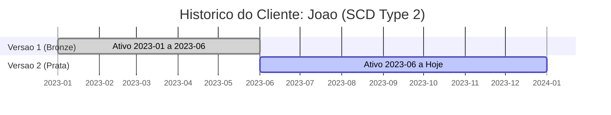

# Aula 8: Slowly Changing Dimensions (SCD) - Parte 1

## 🎯 Objetivos
- Entender o problema das dimensões que mudam ao longo do tempo.
- Conhecer os tipos clássicos de SCD (0, 1, 2 e 3).
- Saber quando aplicar cada estratégia baseada no negócio.

---

## 🕒 O Desafio do Histórico
O que acontece quando um cliente muda de cidade ou um produto muda de categoria?
- Mantemos o dado antigo?
- Sobrescrevemos?
- Como fica o histórico de vendas de 2 anos atrás?

---

## 🛠️ Tipos de SCD
### Type 0: Fixo
O dado nunca muda (ex: Data de Nascimento, CPF original). Não requer lógica de atualização.

### Type 1: Sobrescrever
O valor antigo é apagado e o novo é inserido por cima.
- **Prós:** Simples e economiza espaço.
- **Contras:** Perde total o histórico (Análises retroativas ficam "mentirosas").

### Type 2: Histórico Completo (O Padrão Ouro)
Cria-se uma nova linha para cada mudança, marcando a linha antiga como inativa.
- **Prós:** Preservação total da verdade histórica.
- **Contras:** A tabela cresce e as queries exigem cuidado com datas de validade.

### Type 3: Histórico Parcial
Mantém o valor atual e o valor anterior em colunas diferentes na mesma linha.
- **Uso:** Quando você só precisa comparar o "agora" com o "logo antes".

---

## 📏 Type 2 na Prática
Trabalhamos com campos de controle:
- `data_inicio`: Quando essa versão começou a valer.
- `data_fim`: Quando essa versão expirou.
- `registro_ativo`: Booleano para facilitar filtros rápidos.

---

## 🎨 Visualizando: Linha do Tempo (Type 2)
Como o usuário "João" muda de segmento ao longo do tempo.

---

## 🏁 Fechamento
- SCD Type 2 é a base de qualquer Data Warehouse de qualidade.
- Escolha o tipo de SCD baseado na importância do histórico para aquela coluna específica.
- **Preview:** Na próxima aula, vamos codificar um processo completo de carga SCD Type 2!
