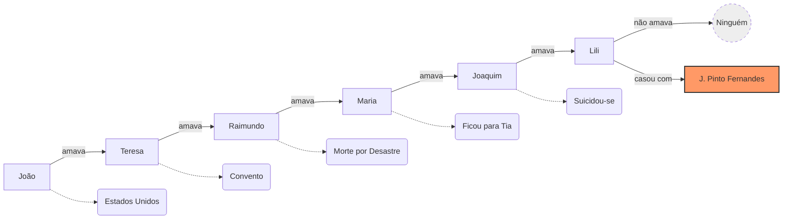
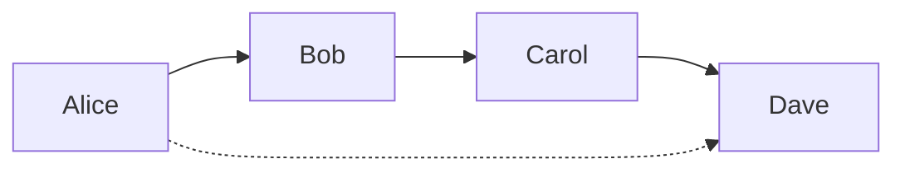
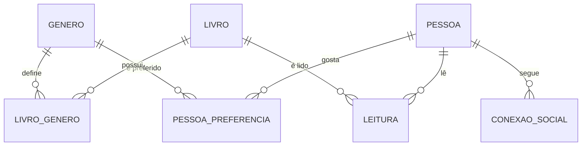

# Aula 9: Modelagem de Grafos (Graph Data Modeling)

## 🎯 Objetivos
- Entender quando os modelos relacionais (tabelas) falham em performance.
- Conhecer os conceitos de **Vértices** (Nodes) e **Arestas** (Edges).
- Implementar e consultar estruturas de grafos dentro do PostgreSQL.

---

## 🕸️ Por que Grafos?
Tabelas são ótimas para dados estruturados, mas péssimas para relacionamentos altamente conectados ou recursivos.
- **Problema:** JOINs recursivos (ex: redes sociais, rotas, detecção de fraude) "explodem" em complexidade e tempo de execução.
- **Solução:** Em um grafo, o relacionamento é um cidadão de primeira classe.

---

## 📐 Vértices e Arestas
1.  **Vértice (Vertex/Node):** Representa a entidade (Pessoa, Cidade, Produto, **Gênero**).
2.  **Aresta (Edge):** Representa o relacionamento entre duas entidades (Amigo de, Segue, **Pertence ao gênero**, **Interesse em**).
3.  **Propriedades:** Atributos que podem viver tanto no vértice quanto na aresta (ex: Data da amizade, Peso da conexão).

---

## 🎭 Exemplo lúdico: "Quadrilha" (Carlos Drummond de Andrade)

O famoso poema de Drummond é um exemplo clássico de **grafo direcionado** onde a estrutura das relações é o ponto central.

### O Grafo das Desilusões

---

**Por que usar Grafos aqui?**
- **Relacionamentos são o dado:** O poema não é sobre as pessoas, mas sobre *quem amava quem*.
- **Novas Entidades:** J. Pinto Fernandes aparece "do nada", algo fácil de plugar em um grafo, mas que exigiria novos registros/FKs em tabelas rígidas.
- **Caminhamento:** "Quem João amava indiretamente?" (João -> Teresa -> Raimundo...).

---

## 🎨 Visualizando: A Força do Grafo
Encontrando conexões indiretas (Amigo do Amigo) em O(1).

---

## 🛠️ Grafos no SQL (PostgreSQL)
Podemos gerenciar grafos usando uma estrutura de duas tabelas:
- `grafo_vertices`: ID, Tipo e Propriedades (JSONB).
- `grafo_arestas`: Origem_ID, Destino_ID, Tipo_Relaçao e Peso.

### Busca Recursiva (Recursive CTE):
Para encontrar conexões indiretas (ex: Amigos de Amigos), usamos `WITH RECURSIVE` no PostgreSQL para "caminhar" pelo grafo.

---

## 🚦 Quando usar?
- **Redes Sociais:** Sugestão de conexões.
- **Logística:** Cálculo de rotas e malha de transporte.
- **Segurança:** Identificação de clusters de fraude através de dados compartilhados (IPs, endereços).
- **Recomendação:** "Pessoas que compraram X também compraram Y".

---

## 🏗️ O Modelo Relacional de Origem
Antes de virar um grafo, nossos dados nascem em um modelo relacional. É importante entender as funções de cada tabela:

### Diagrama Entidade-Relacionamento (ERD)

### Classificação dos Dados:
- **Dimensões (Os Vértices):** `PESSOA`, `LIVRO`, `GENERO`. São os substantivos, as entidades de base.
- **Fatos (As Arestas de Evento):** `LEITURA`. Representa a interação entre instâncias de dimensões diferentes com métricas associadas (ex: nota).
- **Tabelas Ponte / Bridge (As Arestas de Conexão):** `CONEXAO_SOCIAL`, `LIVRO_GENERO` e `PESSOA_PREFERENCIA`. 
    - `CONEXAO_SOCIAL` é uma ponte que conecta a dimensão `PESSOA` a ela mesma.
    - Elas resolvem relacionamentos Muitos-para-Muitos e permitem que o grafo encontre "atalhos" e caminhos de navegação.

---

## 🏁 Fechamento e Fim do Curso!
- Grafos são a ferramenta certa para problemas de conectividade.
- O PostgreSQL lidando com JSONB e CTEs recursivos é extremamente poderoso para grafos híbridos.
- **Parabéns!** Você concluiu a jornada da modelagem operacional à avançada!
