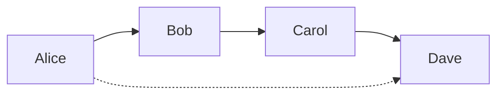

# Aula 10: Modelagem de Grafos (Graph Data Modeling)

## 🎯 Objetivos
- Entender quando os modelos relacionais (tabelas) falham em performance.
- Conhecer os conceitos de **Vértices** (Nodes) e **Arestas** (Edges).
- Implementar e consultar estruturas de grafos dentro do PostgreSQL.

---

## 🕸️ Por que Grafos?
Tabelas são ótimas para dados estruturados, mas péssimas para relacionamentos altamente conectados ou recursivos.
- **Problema:** JOINs recursivos (ex: redes sociais, rotas, detecção de fraude) "explodem" em complexidade e tempo de execução.
- **Solução:** Em um grafo, o relacionamento é um cidadão de primeira classe.

---

## 📐 Vértices e Arestas
1.  **Vértice (Vertex/Node):** Representa a entidade (Pessoa, Cidade, Produto).
2.  **Aresta (Edge):** Representa o relacionamento entre duas entidades (Amigo de, Segue, Localizado em).
3.  **Propriedades:** Atributos que podem viver tanto no vértice quanto na aresta (ex: Data da amizade, Peso da conexão).

---

## 🛠️ Grafos no SQL (PostgreSQL)
Podemos gerenciar grafos usando uma estrutura de duas tabelas:
- `grafo_vertices`: ID, Tipo e Propriedades (JSONB).
- `grafo_arestas`: Origem_ID, Destino_ID, Tipo_Relaçao e Peso.

### Busca Recursiva (Recursive CTE):
Para encontrar conexões indiretas (ex: Amigos de Amigos), usamos `WITH RECURSIVE` no PostgreSQL para "caminhar" pelo grafo.

---

## 🚦 Quando usar?
- **Redes Sociais:** Sugestão de conexões.
- **Logística:** Cálculo de rotas e malha de transporte.
- **Segurança:** Identificação de clusters de fraude através de dados compartilhados (IPs, endereços).
- **Recomendação:** "Pessoas que compraram X também compraram Y".

---

## 🎨 Visualizando: A Força do Grafo
Encontrando conexões indiretas (Amigo do Amigo) em O(1).

---

## 🏁 Fechamento e Fim do Curso!
- Grafos são a ferramenta certa para problemas de conectividade.
- O PostgreSQL lidando com JSONB e CTEs recursivos é extremamente poderoso para grafos híbridos.
- **Parabéns!** Você concluiu a jornada da modelagem operacional à avançada!
