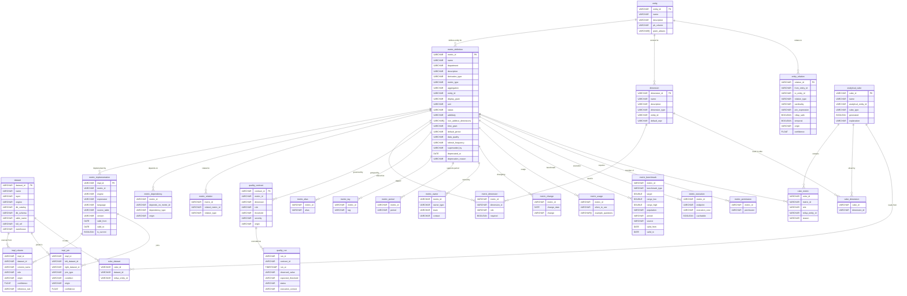

```mermaid
erDiagram
    entity {
        VARCHAR entity_id PK
        VARCHAR name
        VARCHAR description
        VARCHAR pk_column
        VARCHAR[] grain_aliases
    }
    entity_relation {
        VARCHAR relation_id PK
        VARCHAR from_entity_id
        VARCHAR to_entity_id
        VARCHAR relation_type
        VARCHAR cardinality
        VARCHAR join_expression
        BOOLEAN rollup_safe
        BOOLEAN temporal
        VARCHAR origin
        FLOAT confidence
    }
    dimension {
        VARCHAR dimension_id PK
        VARCHAR name
        VARCHAR description
        VARCHAR dimension_type
        VARCHAR entity_id
        VARCHAR default_expr
    }
    dataset {
        VARCHAR dataset_id PK
        VARCHAR name
        VARCHAR layer
        VARCHAR engine
        VARCHAR db_catalog
        VARCHAR db_schema
        VARCHAR table_name
        VARCHAR full_ref
        VARCHAR warehouse
    }
    metric_definition {
        VARCHAR metric_id PK
        VARCHAR name
        VARCHAR department
        VARCHAR description
        VARCHAR derivation_type
        VARCHAR metric_type
        VARCHAR aggregation
        VARCHAR entity_id
        VARCHAR display_grain
        VARCHAR unit
        VARCHAR status
        VARCHAR additivity
        VARCHAR[] non_additive_dimensions
        VARCHAR time_grain
        VARCHAR default_period
        VARCHAR data_quality
        VARCHAR refresh_frequency
        VARCHAR superseded_by
        DATE deprecated_at
        VARCHAR deprecation_reason
    }
    metric_implementation {
        VARCHAR impl_id PK
        VARCHAR metric_id
        VARCHAR engine
        VARCHAR expression
        VARCHAR language
        VARCHAR source_table
        VARCHAR version
        DATE valid_from
        DATE valid_to
        BOOLEAN is_current
    }
    impl_column {
        VARCHAR impl_id
        VARCHAR dataset_id
        VARCHAR column_name
        VARCHAR role
        VARCHAR origin
        FLOAT confidence
        VARCHAR inference_rule
    }
    impl_join {
        VARCHAR impl_id
        VARCHAR left_dataset_id
        VARCHAR right_dataset_id
        VARCHAR join_type
        VARCHAR condition
        VARCHAR origin
        FLOAT confidence
    }
    metric_dependency {
        VARCHAR metric_id
        VARCHAR depends_on_metric_id
        VARCHAR dependency_type
        VARCHAR origin
    }
    metric_relation {
        VARCHAR metric_id
        VARCHAR related_metric_id
        VARCHAR relation_type
    }
    metric_dimension {
        VARCHAR metric_id
        VARCHAR dimension_id
        VARCHAR role
        BOOLEAN required
    }
    quality_contract {
        VARCHAR contract_id PK
        VARCHAR metric_id
        VARCHAR dimension
        VARCHAR rule
        VARCHAR threshold
        VARCHAR severity
        VARCHAR origin
    }
    quality_run {
        VARCHAR run_id
        VARCHAR contract_id
        TIMESTAMP run_at
        VARCHAR observed_value
        VARCHAR expected_threshold
        VARCHAR status
        VARCHAR execution_context
    }
    metric_alias {
        VARCHAR metric_id
        VARCHAR alias
    }
    metric_tag {
        VARCHAR metric_id
        VARCHAR tag
    }
    metric_period {
        VARCHAR metric_id
        VARCHAR period
    }
    metric_owner {
        VARCHAR metric_id
        VARCHAR owner_type
        VARCHAR team
        VARCHAR contact
    }
    metric_change {
        VARCHAR metric_id
        DATE change_date
        VARCHAR change
    }
    metric_usage {
        VARCHAR metric_id
        VARCHAR when_to_use
        VARCHAR[] example_questions
    }
    metric_benchmark {
        VARCHAR metric_id
        VARCHAR benchmark_type
        DOUBLE target
        DOUBLE range_low
        DOUBLE range_high
        VARCHAR population
        VARCHAR period
        VARCHAR source
        DATE valid_from
        DATE valid_to
    }
    metric_execution {
        VARCHAR metric_id
        VARCHAR endpoint
        VARCHAR execution_cost
        BOOLEAN cacheable
    }
    metric_permission {
        VARCHAR metric_id
        VARCHAR permission
    }
    analytical_cube {
        VARCHAR cube_id PK
        VARCHAR name
        VARCHAR analytical_entity_id
        VARCHAR cube_type
        BOOLEAN generated
        VARCHAR explanation
    }
    cube_metric {
        VARCHAR cube_id
        VARCHAR metric_id
        VARCHAR role
        VARCHAR rollup_entity_id
        VARCHAR reason
    }
    cube_dimension {
        VARCHAR cube_id
        VARCHAR dimension_id
    }
    cube_dataset {
        VARCHAR cube_id
        VARCHAR dataset_id
        VARCHAR rollup_entity_id
    }

    entity ||--o{ metric_definition : "defines entity for"
    entity ||--o{ dimension : "context for"
    metric_definition ||--o{ metric_implementation : "implemented by"
    metric_definition ||--o{ metric_dependency : "depends on"
    metric_definition ||--o{ metric_relation : "related to"
    metric_definition ||--o{ metric_dimension : "grouped by"
    metric_definition ||--o{ quality_contract : "governed by"
    metric_definition ||--o{ metric_alias : "aliased as"
    metric_definition ||--o{ metric_tag : "tagged"
    metric_definition ||--o{ metric_period : "supports period"
    metric_definition ||--o{ metric_owner : "owned by"
    metric_definition ||--o{ metric_change : "changelog"
    metric_definition ||--o{ metric_usage : "usage"
    metric_definition ||--o{ metric_benchmark : "benchmark"
    metric_definition ||--o{ metric_execution : "execution"
    metric_definition ||--o{ metric_permission : "requires"
    dimension ||--o{ metric_dimension : "used in"
    metric_implementation ||--o{ impl_column : "reads column"
    metric_implementation ||--o{ impl_join : "joins"
    dataset ||--o{ impl_column : "sourced from"
    dataset ||--o{ impl_join : "joined in"
    quality_contract ||--o{ quality_run : "executed as"
    entity ||--o{ entity_relation : "relates to"
    analytical_cube ||--o{ cube_metric : "contains"
    analytical_cube ||--o{ cube_dimension : "sliced by"
    analytical_cube ||--o{ cube_dataset : "reads from"
    metric_definition ||--o{ cube_metric : "member of"
    dimension ||--o{ cube_dimension : "used in cube"
    dataset ||--o{ cube_dataset : "in cube"
```