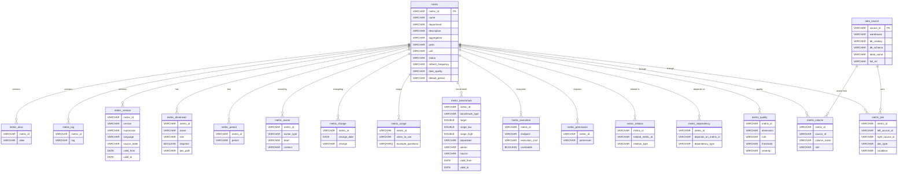

```mermaid
erDiagram
    metric {
        VARCHAR metric_id PK
        VARCHAR name
        VARCHAR department
        VARCHAR description
        VARCHAR aggregation
        VARCHAR grain
        VARCHAR unit
        VARCHAR status
        VARCHAR refresh_frequency
        VARCHAR data_quality
        VARCHAR default_period
    }
    metric_alias {
        VARCHAR metric_id
        VARCHAR alias
    }
    metric_tag {
        VARCHAR metric_id
        VARCHAR tag
    }
    metric_version {
        VARCHAR metric_id
        VARCHAR version
        VARCHAR expression
        VARCHAR language
        VARCHAR source_table
        DATE valid_from
        DATE valid_to
    }
    metric_dimension {
        VARCHAR metric_id
        VARCHAR name
        VARCHAR role
        BOOLEAN required
        VARCHAR join_path
    }
    metric_period {
        VARCHAR metric_id
        VARCHAR period
    }
    metric_owner {
        VARCHAR metric_id
        VARCHAR owner_type
        VARCHAR team
        VARCHAR contact
    }
    metric_change {
        VARCHAR metric_id
        DATE change_date
        VARCHAR change
    }
    metric_usage {
        VARCHAR metric_id
        VARCHAR when_to_use
        VARCHAR[] example_questions
    }
    metric_benchmark {
        VARCHAR metric_id
        VARCHAR benchmark_type
        DOUBLE target
        DOUBLE range_low
        DOUBLE range_high
        VARCHAR population
        VARCHAR period
        VARCHAR source
        DATE valid_from
        DATE valid_to
    }
    metric_execution {
        VARCHAR metric_id
        VARCHAR endpoint
        VARCHAR execution_cost
        BOOLEAN cacheable
    }
    metric_permission {
        VARCHAR metric_id
        VARCHAR permission
    }
    metric_relation {
        VARCHAR metric_id
        VARCHAR related_metric_id
        VARCHAR relation_type
    }
    metric_dependency {
        VARCHAR metric_id
        VARCHAR depends_on_metric_id
        VARCHAR dependency_type
    }
    metric_quality {
        VARCHAR metric_id
        VARCHAR dimension
        VARCHAR rule
        VARCHAR threshold
        VARCHAR severity
    }
    data_source {
        VARCHAR source_id PK
        VARCHAR warehouse
        VARCHAR db_catalog
        VARCHAR db_schema
        VARCHAR table_name
        VARCHAR full_ref
    }
    metric_column {
        VARCHAR metric_id
        VARCHAR source_id
        VARCHAR column_name
        VARCHAR role
    }
    metric_join {
        VARCHAR metric_id
        VARCHAR left_source_id
        VARCHAR right_source_id
        VARCHAR join_type
        VARCHAR condition
    }

    metric ||--o{ metric_alias : "contains"
    metric ||--o{ metric_tag : "contains"
    metric ||--o{ metric_version : "versions"
    metric ||--o{ metric_dimension : "has"
    metric ||--o{ metric_period : "has"
    metric ||--o{ metric_owner : "owned by"
    metric ||--o{ metric_change : "changelog"
    metric ||--o{ metric_usage : "usage"
    metric ||--o{ metric_benchmark : "benchmark"
    metric ||--o{ metric_execution : "execution"
    metric ||--o{ metric_permission : "requires"
    metric ||--o{ metric_relation : "related to"
    metric ||--o{ metric_dependency : "depends on"
    metric ||--o{ metric_quality : "quality"
    metric ||--o{ metric_column : "lineage"
    metric ||--o{ metric_join : "lineage"
    data_source ||--o{ metric_column : "reads from"
    data_source ||--o{ metric_join : "joins"
```