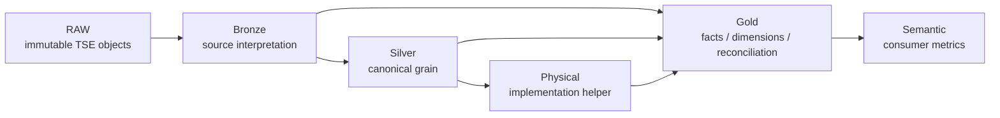

# TSE analytical model DAG



Allowed dependency direction:

```text
RAW -> Bronze -> Silver -> Gold -> Semantic
                 |
                 +-> Physical -> Gold
```

Backward dependencies are architectural violations and should fail CI.
