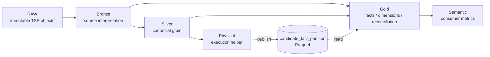

# TSE analytical model DAG



Logical dependencies are validated through `ref()`. Physical lineage is declared
with `meta.physical_publish` and `meta.physical_source`, so external persisted
artifacts do not disappear from architectural lineage.

Bronze/Silver leaf models must either feed another model or explicitly declare
`meta.architecture_status='orphan'` with an `architecture_reason`.

## Layer selectors

```bash
make dbt-bronze
make dbt-silver
make dbt-gold
make dbt-semantic-layer
make medallion-contracts
```
